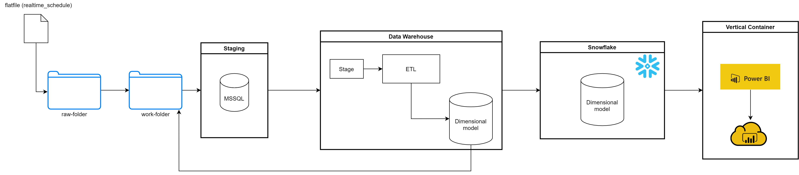
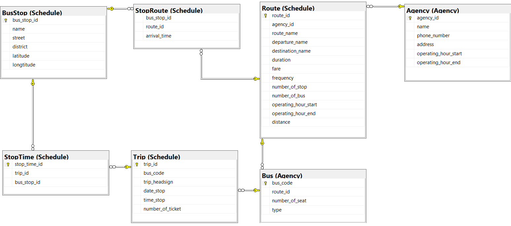
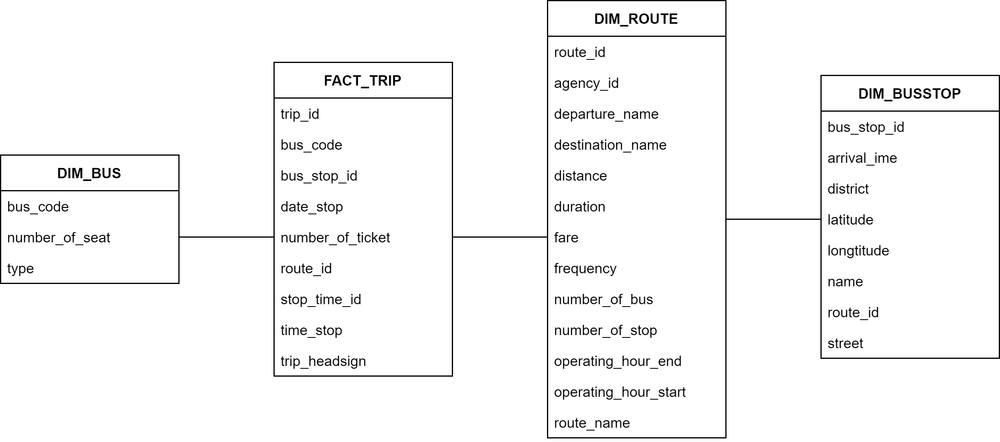
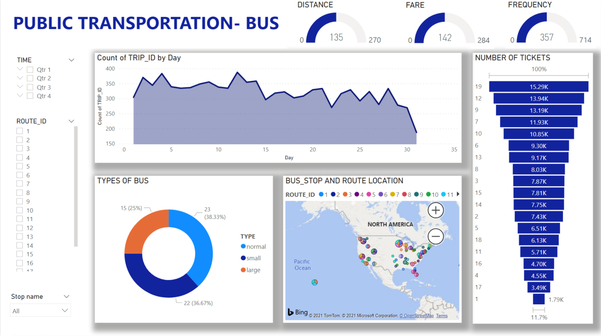

# Public Transportation Data Pipeline

### Decsription of this project

Allocate resource and scheduling based on route, traffic, transport type information.

### Purpose

Building the data pipeline.

## :bus: Detail of Work
1. Generate data
    - Generate data using `resources/data-generator.py` script to `raw-folder` and copy it to `work-folder`.
2. Design data pipeline 
    
3. Build data model
    - Schema
    
    - Dimensional model
    
4. Ingest data, Extract and Load into Data warehouse
    - The flat file data first go into the staging area, where preprocessing with SSIS and put to MSSQL.
5. Load data onto Snowflake with the transformation
    - The SSIS will execute `src/snowflake/putFile.bat` to run `put` command on Snowflake (load data to the internal stage on Snowflake).
    - `src/snowflake/loadData.py` will run after that to connect Snowflake endpoint to `copy` data from internal stage to destination table.
6. Visualize your data
    - Data on the dimensional tables is visualized on the Power BI dashboard.



## :rocket: Getting Started
### Prerequisites
- Install [Snowsql](https://docs.snowflake.com/en/user-guide/snowsql.html) and add the following setting to `config` file (Windows: `config` file located at `C:\Users\<user-name>\.snowsql`): 
    ```
    [connections.loadingdb]
    accountname = <accountname> # Ask the repo owner for the accountname
    username = <username> # Ask the repo owner for the username
    password = <password> # Ask the repo owner for the password
    warehousename = COMPUTE_LOADING
    dbname = PUBLICTRANSPORTATION
    schemaname = PUBLIC
    rolename = sysadmin
    ```
- Install python dependencies: `pip install -r requirements.txt`. 
    Make sure you can import libraries using `cmd`.
    We recommend installing [Anaconda](https://www.anaconda.com/) and add `conda` environment to windows `PATH`.
- Clone the repo:
    ```
    git clone https://github.com/dhuy237/fa-project-1-team-7.git
    ```

### Usage
1. Generate data: `python resources/data-generator.py`
2. Login into MSSQL and run [init_mssql.sql](./src/mssql/init_mssql.sql)
3. Authen SnowSQL and run [init_snowflake.sql](./src/snowflake/init_snowfalke.sql)
4. Open `src/snowflake/putFile.bat`:
    - Change the `-f` file path to the folder contain `src/snowflake/ssis2snow.sql` file.
5. Open `src/snowflake/ssis2snow.sql`:
    - Change all the path to the place that contains `resources/work-folder`, keep all the `.csv` name after the path.
6. Open `src/snowflake/loadData.py`:
    - Change `SRA_PATH`: Generate RSA key with the following command (Snowflake [document](https://docs.snowflake.com/en/user-guide/key-pair-auth.html)), you can change the directory to a temp folder so that it does not overwrite your existing key:
    ```bash
    openssl genrsa 2048 | openssl pkcs8 -topk8 -inform PEM -out rsa_key.p8
    openssl rsa -in rsa_key.p8 -pubout -out rsa_key.pub
    ```
    - Send the `rsa_key.pub` file to the repo owner to add to your Snowflake user account.
    - Change `LOG_PATH`: Change your path to the place contains `resources/logs`.
7. Open SSIS [solution](./src/project1_team7_FA):
    - Update `localhost.PublicTransportation` connection to the local database on SSMS.
    - Update `variables`:
        - `DataPath`: change your path to the place contains `resources/work-folder`.
        - `ErrorPath`: change your path to the place contains `resources/logs`.
        The error log will be stored here if there is any error during execution.
        - `ExecutePath`: change your path to the place contains `src/snowflake`.
        - `PythonExecutionPath`: change your path to the place contains `python.exe`.
        If you use Anaconda, the path should look like this `C:\Users\<user-name>\Anaconda3\python.exe`.
    - Execute the package.

## :round_pushpin: Roadmap

See the [open issues](https://github.com/dhuy237/fa-project-1-team-7/issues) for a list of proposed features (and known issues).

## :hammer: Contributing

Contributions are what make the open source community such an amazing place to be learn, inspire, and create. Any contributions you make are **greatly appreciated**.

1. Fork the Project.
2. Create your Feature Branch (`git checkout -b feature/Feature`).
3. Commit your Changes (`git commit -m 'Add some feature'`).
4. Push to the Branch (`git push origin feature/Feature`).
5. Open a Pull Request.

## :mailbox: Contact
- Huy Tran ([dhuy237](https://github.com/dhuy237)) - d.huy723@gmail.com
- Quyen Mai ([mtquyen](https://github.com/mtquyen)) - maithiquyen124@gmail.com